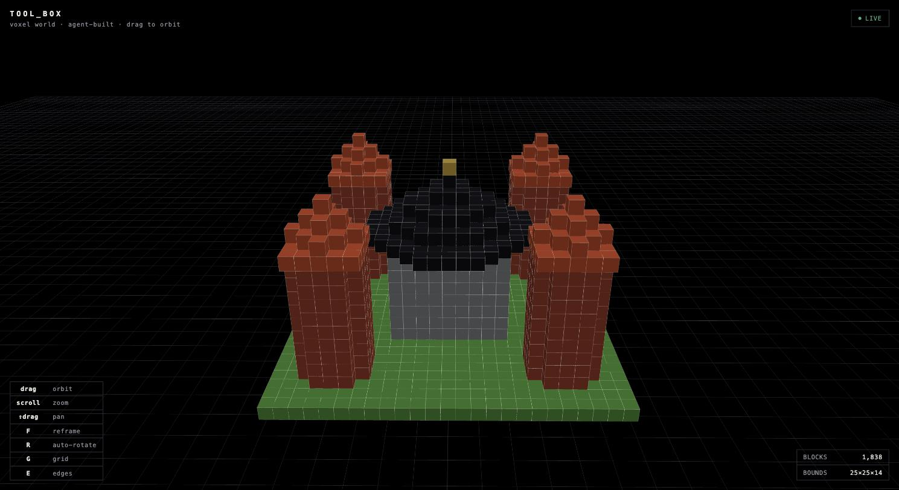
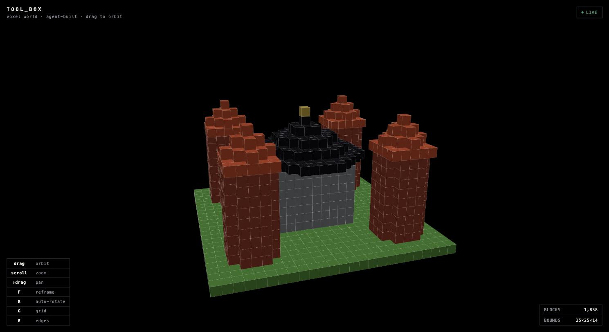

# Tool_Box

[](https://github.com/Timothy-Lee-Grant/Tool_Box/actions/workflows/ci.yml)


An MCP (Model Context Protocol) server platform: a thin host that exposes independent, hot-swappable **toolsets** to AI agents — Claude Desktop, Claude Code, and, over HTTP, other agent systems such as [LLM_Monitor](https://github.com/Timothy-Lee-Grant/LLM_Monitor)'s LangGraph tool loop.

The LLM is the brain; this project is the hands.

<p align="center">
  
</p>

<p align="center"><sub>Every block above was placed by a real MCP tool call — <code>place_box</code>, <code>place_cylinder</code>, <code>place_cone</code>, <code>remove_box</code> — over the same wire an agent uses, rendered live in a browser as the calls land. No part of that image was hand-placed.</sub></p>

---

## What this is

Tool_Box is a C#/.NET 10 implementation of an [MCP](https://modelcontextprotocol.io/) server — the same open protocol Claude Desktop, Claude Code, and a growing set of agent frameworks use to call tools. Most MCP servers wrap one API. This one is a **platform**: a Host that knows nothing about any specific capability, a Core library of shared plumbing (bounded output, structured logging, server metadata), and a growing set of **toolsets** — independent class libraries that plug into the Host through exactly one line of composition code each.

Two toolsets exist today:

- **Basics** — connectivity/identity tools (`ping`, `server_info`, `current_time`) that proved the platform's plumbing before anything interesting was built on it.
- **Voxel** — a live, agent-buildable 3D world. Twelve tools (`place_box`, `place_sphere`, `place_cylinder`, `place_cone`, `place_tube`, `mirror`, `remove_box`, ...) that describe *shape*, not coordinates — an agent says "a hollow cylinder, radius 3, height 8," and the server rasterizes that into cubes. Every change broadcasts over a WebSocket to a live Three.js browser viewer, independent of whichever MCP transport the agent is actually connected over.

## What this project demonstrates

Not a list of buzzwords — every line below is backed by something you can actually run or read in this repo.

| Area | Evidence |
|---|---|
| **System architecture under real constraint** | Host/Core/Toolset boundary held through a second toolset with genuinely different needs (stateful, write-classified, its own background service) — with **zero diffs** required in `Core/` (measured, not claimed — see [ADR-003](docs/DECISIONS.md), [ADR-010](docs/DECISIONS.md)). |
| **Protocol & networking depth** | A single binary serving two MCP transports (stdio, streamable HTTP) selected at runtime, plus a hand-rolled `HttpListener`-based WebSocket server with a correct close handshake — a real bug in that handshake was found and fixed during development, not shipped (see [Lecture 004, §9 and §17](Documentation/Learning/004-State-Sockets-And-Shapes.md)). |
| **Testing discipline** | 77 tests across four projects — pure-logic unit tests, tool-layer functional tests with zero MCP/server involved, and wire-level integration tests that boot the real HTTP app and call it with the real MCP client SDK. CI runs all of it, plus a container boot-and-healthcheck smoke test, on every push. |
| **Engineering judgment under review** | Every non-trivial decision is a dated, append-only [Architecture Decision Record](docs/DECISIONS.md) (11 so far) — including one that explicitly revises an earlier security assumption once circumstances changed, with the reasoning written down rather than silently overridden. |
| **Security posture, stated not assumed** | The HTTP transport's threat model (isolation vs. authentication, what actually gates exposure) is documented and was re-examined, on the record, the moment a write-classified toolset made the original assumption stale ([ADR-008](docs/DECISIONS.md), [ADR-011](docs/DECISIONS.md)). |
| **AI-assisted engineering, done deliberately** | This project is built through a staged process — written design goals → recorded discussion → a reviewed implementation plan → step-by-step permissioned execution — logged in full in [`Documentation/ImplementationPlans`](Documentation/ImplementationPlans/). It's a real, repeatable answer to "how do you use AI tools responsibly as an engineer," not an anecdote. |
| **Communicating technical work** | Every feature has a companion lecture in [`Documentation/Learning`](Documentation/Learning/) written to teach the concepts it required — dependency injection and IoC, hosted-service lifecycles, WebSocket protocol mechanics, discriminated-union patterns in C#, and more, each grounded in this codebase's own files. |

## Architecture

```
  MCP client (Claude Desktop / Code / Inspector / LangGraph agent)
        │  stdio  ─or─  streamable HTTP (:8080/mcp, /health)
        ▼
  ToolBox.Host        thin composition root: config → toolsets → transport
        │
  ToolSets/*          independent capability libraries (Basics, Voxel, ...)
        │
  ToolBox.Core        shared plumbing: bounded output, server info, logging rules
```

The Voxel toolset also brings its own companion infrastructure — a `BackgroundService` that broadcasts world changes over a loopback WebSocket (`:8090`, independent of and never colliding with the MCP HTTP transport's own `:8080`) to the live browser viewer shown above. Design rules that held across both toolsets: toolsets never know about the protocol or each other; the Host never contains domain logic; all tool output is bounded; a stdio server's stdout belongs to the protocol — logs go to stderr, always, checked on every change, not assumed.

## Quickstart

Requires the [.NET 10 SDK](https://dotnet.microsoft.com/download) (current LTS).

```bash
git clone git@github.com:Timothy-Lee-Grant/Tool_Box.git
cd Tool_Box
dotnet build            # zero warnings — Directory.Build.props makes any warning fatal
dotnet test              # 77 tests, four projects
```

If both commands finish clean, the environment is verified end to end — nothing below requires anything you haven't already proven works.

## See it build something live

This is the fastest way to see the platform actually do something, using the same MCP wire a real agent uses.

**1. Build once in Release** (register the built DLL, not `dotnet run` — no build system in the protocol's launch path):

```bash
dotnet build -c Release
```

**2. Start the viewer** (a plain static page — no Tool_Box code serves it, no build step required):

```bash
cd viewer && npx --yes serve .        # or: python3 -m http.server 5500
```

Open the printed URL in a browser — it will read **connecting…**, then **live**, showing an empty grid.

**3. Point an MCP client at the Host.** Any of the following work identically — the tool catalog is transport-independent by design:

<details>
<summary><b>Claude Desktop</b> (<code>claude_desktop_config.json</code>)</summary>

```json
{
  "mcpServers": {
    "toolbox": {
      "command": "dotnet",
      "args": ["/absolute/path/to/Tool_Box/src/ToolBox.Host/bin/Release/net10.0/ToolBox.Host.dll"]
    }
  }
}
```
</details>

<details>
<summary><b>Claude Code</b></summary>

```bash
claude mcp add toolbox -- dotnet /absolute/path/to/Tool_Box/src/ToolBox.Host/bin/Release/net10.0/ToolBox.Host.dll
```
</details>

<details>
<summary><b>MCP Inspector</b> (interactive, no client needed)</summary>

```bash
npx @modelcontextprotocol/inspector dotnet src/ToolBox.Host/bin/Release/net10.0/ToolBox.Host.dll
```
</details>

**4. Ask it to build something** — `world_info`, then `place_box`/`place_cylinder`/`place_cone`/`mirror`, in whatever order makes sense for what you're describing. Watch the browser tab; each call renders within about a second. (An agent following `.claude/skills/voxel/SKILL.md` — this project's own skill file — will do this well on its own; ask for "a small castle" and compare the result to the screenshot above.)

<p align="center">
  
</p>
<p align="center"><sub>Drag to orbit, scroll to zoom, right-drag to pan. <code>F</code> reframes, <code>R</code> toggles auto-rotate, <code>G</code>/<code>E</code> toggle the grid and edges shown above.</sub></p>

Full tool reference: [`docs/TOOL_CATALOG.md`](docs/TOOL_CATALOG.md). Design rationale for every non-obvious choice: [`docs/DECISIONS.md`](docs/DECISIONS.md).

## Transports

One binary, two wires, selected at startup — precedence `--transport` flag > `TOOLBOX_TRANSPORT` env var > `appsettings.json` (default: stdio).

| Transport | Start | Use for |
|---|---|---|
| stdio (default) | client launches the DLL | Claude Desktop, Claude Code — local, client-as-parent |
| streamable HTTP | `dotnet run --project src/ToolBox.Host -- --transport http` | remote/containerized consumers (LLM_Monitor); serves `/mcp` + `/health` on `:8080`, stateless |

## Containerized

```bash
docker compose up --build        # healthy at http://localhost:8081/health
# Inspector → Streamable HTTP → http://localhost:8081/mcp
```

Multi-stage, non-root, layer-cache-ordered Dockerfile; CI builds the image and polls `/health` on every push, so "the container boots" is a continuously-verified claim, not documentation that quietly drifted from reality. Consuming this from another project (LLM_Monitor's LangGraph agent, via `langchain-mcp-adapters`): [`docs/LLM_MONITOR_INTEGRATION.md`](docs/LLM_MONITOR_INTEGRATION.md).

## The engineering process behind this repo

Every plan in this project follows the same staged shape, and the full back-and-forth is preserved, not summarized after the fact:

1. **Design goals**, written down before any code.
2. **Discussion** — architecture options, tradeoffs, open questions, argued out and recorded.
3. **A step-by-step implementation plan**, reviewed before execution begins.
4. **Permissioned execution**, one step at a time, each with a checkpoint verified for real (a real browser, a real socket, a real second process) rather than assumed from reading the diff.
5. **Verification and retrospective**, including the actual bugs found and how.

Read the source material, not a summary of it:

- [`Documentation/ImplementationPlans/`](Documentation/ImplementationPlans/) — every plan's full design-through-execution log, this feature's included.
- [`Documentation/Learning/`](Documentation/Learning/) — a teaching lecture per feature, each grounded entirely in this codebase's own files, code snippets included.
- [`Documentation/Brainstorms/`](Documentation/Brainstorms/) — the open-ended exploration that fed the roadmap before anything was scoped into a plan.
- [`docs/DECISIONS.md`](docs/DECISIONS.md) — the append-only architecture decision log (Michael Nygard's ADR format): context, decision, consequences, superseded-not-edited.

## Status

- **Plan 001** — MVP foundation: Host/Core/Basics, DI conventions, stdio transport, honest CI. *Done.*
- **Plan 002** — Streamable HTTP transport, Docker, LLM_Monitor integration walkthrough. *Done.*
- **Plan 003** — Voxel toolset: stateful world model, shape-rasterization primitives, a live WebSocket viewer, a Claude Code skill file. *Done — this is the feature shown above.*
- **Plan 004** — A SPICE-backed electrical circuit design toolset (describe a circuit, get it simulated and exported). *Designed, deferred.*
- **Next** — real LLM_Monitor consumption of the Voxel toolset (via that repo's own plan); revisit plan 004.

Current toolset/tool count: **2 toolsets, 15 tools**, all documented in [`docs/TOOL_CATALOG.md`](docs/TOOL_CATALOG.md).
